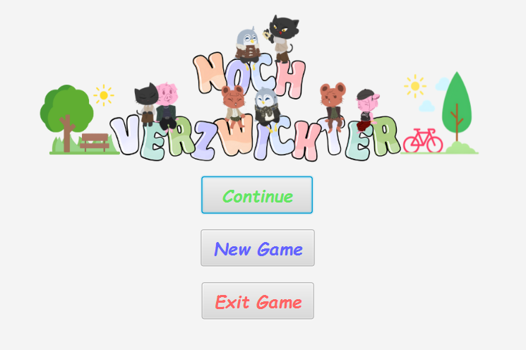
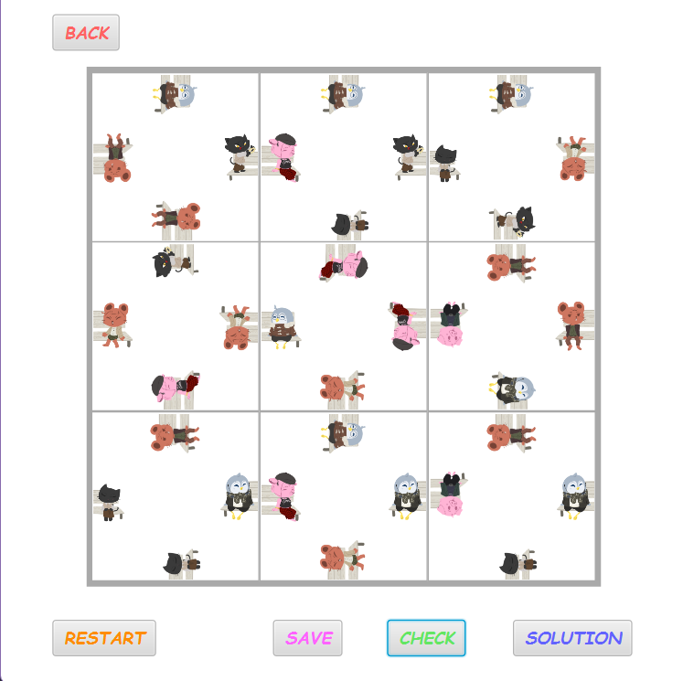

# Noch Verzwickter

Welcome to the Noch Verzwickter project developed by FKy Team. This project is a JavaFX-based game application.

## Team Members

- Duc Manh Pham - 1584512
- Dinh Nam Vu - 1585775
- Bao Long Pham - 1584497

## Introduction

Noch Verzwickter is a puzzle game where players need to match icons by interacting with the game board.

## Features

- Start a new game
- Continue a saved game
- Save the current game state
- Restart the game
- Exit the application

## Technologies Used

- JavaFX
- Apache Maven

## Getting Started

Follow these instructions to get a copy of the project up and running on your local machine for development and testing purposes.

### Prerequisites

- Java Development Kit (JDK) 13 or higher
- Apache Maven
- An IDE such as IntelliJ IDEA or Visual Studio Code

### Installing

1. Clone the repository:
    ```sh
    git clone https://github.com/manhneee/OOP_Java_Final_Project.git
    cd demo
    ```

2. Open the project in your IDE.

3. Build the project using Maven:
    ```sh
    mvn clean install
    ```

4. Run the project:
    ```sh
    mvn javafx:run
    ```

## Project Structure

The workspace contains the following folders:

- `src`: Contains the source code for the application.
  - `main`: Contains the main application code.
    - `java`: Contains the Java source files.
    - `resources`: Contains the resource files such as FXML and images.
  - `test`: Contains the test code.

- `target`: Contains the compiled output files.

## Usage

1. Launch the application.
2. Use the menu to start a new game, continue a saved game, or exit the application.
3. Interact with the game board by clicking and dragging the cards to solve the puzzle.

## Screenshots

<p align="center">
  
  <br>
  <i>1. Main Menu</i>
</p>

<p align="center">
  
  <br>
  <i>2. Game Play</i>
</p>

## Contributing

1. Fork the repository.
2. Create your feature branch:
    ```sh
    git checkout -b feature/your-feature
    ```
3. Commit your changes:
    ```sh
    git commit -m 'Add some feature'
    ```
4. Push to the branch:
    ```sh
    git push origin feature/your-feature
    ```
5. Open a pull request.

## License

This project is licensed under the MIT License - see the [LICENSE](/LICENSE) file for details.

## Acknowledgments

- Thanks to the JavaFX community for their support and resources.
- Special thanks to all team members for their contributions.